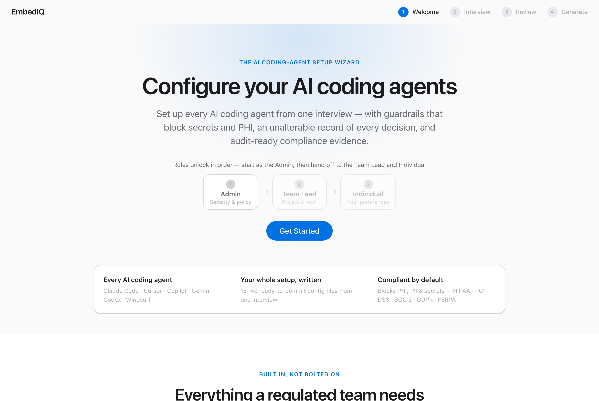
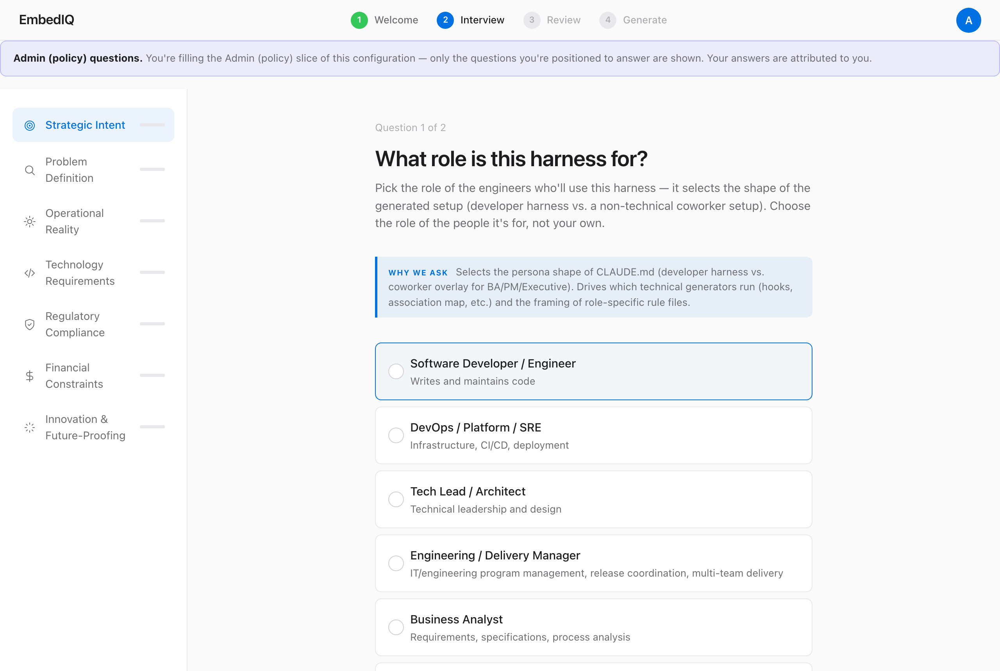
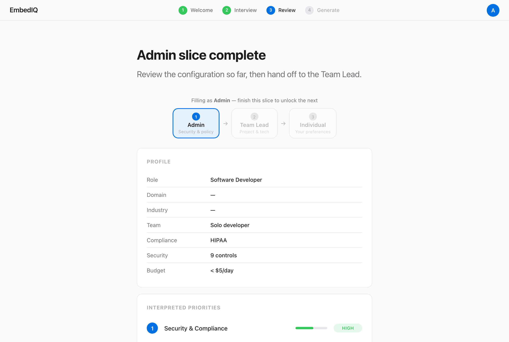
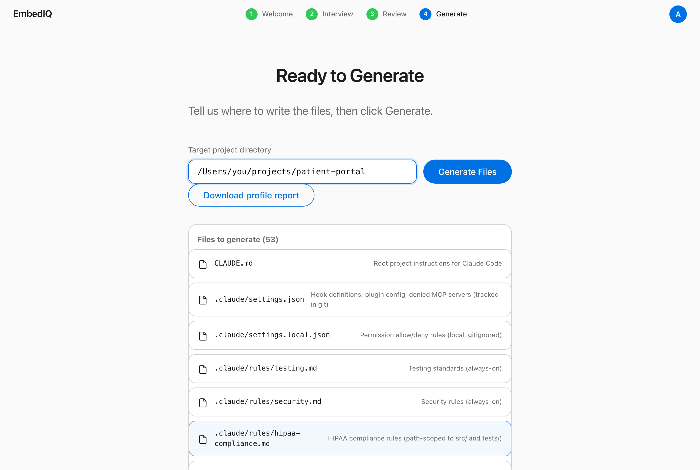

<!-- audience: public -->

# EmbedIQ

**Governed configuration for every AI coding agent — from one interview.**

*Answer a few questions about your project, and EmbedIQ writes the setup files
that make Claude Code, Cursor, Copilot, and other AI coding assistants follow
your team's rules — consistently, and with an audit trail.*

[](LICENSE) · [Latest release: **v4.0.6**](https://github.com/asq-sheriff/embediq/releases/latest) · Deterministic & offline

EmbedIQ interviews you once about your project, team, and compliance
obligations, then generates a complete, governed agent harness — typically
15–40 files — for every major AI coding agent from a single answer set:
**Claude Code, Cursor, GitHub Copilot, Gemini, Windsurf, and cross-agent
`AGENTS.md`**. The generator makes **zero LLM calls**, so the same answers
always produce **byte-identical output** — including under regulatory audit.

[Full changelog](CHANGELOG.md) ·
[Security model](SECURITY.md) ·
[Documentation](docs/getting-started.md)

---

## What EmbedIQ does, in plain terms

AI coding assistants — Claude Code, Cursor, GitHub Copilot, and the rest — each
read a small **setup file** that tells them the rules of *your* project: what
you're building, what language it's written in, and what they must never do
(at a hospital, for example, *"never put a patient's record into code, comments,
or logs"*). Writing those files by hand for every tool — and keeping them all
saying the same thing — is slow and easy to get wrong.

**EmbedIQ does it for you.** You answer a set of plain questions about your
project, your team, and any rules you have to follow. EmbedIQ turns those answers
into all of the setup files automatically — the same way every time, with no AI
guesswork in the middle.

- **Who it's for** — any team using AI coding assistants that wants them set up
  the same way for everyone, especially in regulated fields like healthcare,
  finance, or government, where an assistant doing the wrong thing is a
  compliance problem, not just a bug.
- **What you do** — answer an interview (10–15 minutes), in the browser or the
  terminal. No coding required to run it.
- **What you get** — a folder of ready-to-use config files you drop into your
  project, so every developer's AI assistant follows the same safe rules from
  day one, plus a record you can show an auditor proving what was set up and why.

---

## See it in action

One interview, four steps — from a role-scoped handoff to a folder of ready-to-commit files.

**1. Start the role-scoped handoff.** Roles unlock in order — the Admin sets security & policy, then hands off to the Team Lead (project & tech) and the Individual (per-seat preferences). The Team Lead and Individual stay locked until the prior slice is done.



**2. Answer only your slice.** Each role is asked just the questions it owns — seven dimensions in the sidebar, role-adaptive wording, and an admin-only "why we ask" panel.



**3. Review and hand off.** Each slice ends in a summary of what's configured so far, then passes the baton to the next role.



**4. Files ready — pick a location and generate.** After the final slice, EmbedIQ shows every file it will write and asks where to put them.



---

## Why it matters

Most teams use four to six AI coding tools at once, and each one wants its rules
written in its own way. So the same rules get copied from tool to tool, fall out
of step as people edit them by hand, and quietly go stale. Compliance teams have
no single place to check; every developer's machine ends up a little different;
and each new hire sets the whole thing up again from scratch.

EmbedIQ replaces all of that with **one source of truth** built from your
answers — and keeps it that way. It spots when files have been changed or have
drifted out of date, can regenerate them on a schedule, and produces the exact
same output every time. Because no AI runs while the files are written, the
result is repeatable and provable, not a best guess.

---

## What the compliance standards mean — and why enterprises care

In a large company, much of EmbedIQ's value is keeping AI assistants on the
right side of rules the company is legally or contractually bound to. Those
rules have names. Here's what they are in plain English, and what's at stake
when they're broken:

| Standard | What it is | Why an enterprise cares |
| --- | --- | --- |
| **HIPAA** | US law protecting patients' health information (PHI). | A hospital or insurer that leaks patient data faces heavy fines and lawsuits. An AI assistant that pastes a medical record into a log *is* a HIPAA breach. |
| **PCI-DSS** | The payment-card industry's rules for handling credit-card data. | Any company that takes card payments must comply or lose the ability to process cards at all. A leaked card number is a reportable incident. |
| **SOC 2** | An independent audit proving a company handles customer data securely. | Enterprise buyers routinely *refuse to purchase* software without a SOC 2 report — it's a gate to closing deals. |
| **GDPR** | The EU's privacy law covering anyone's personal data. | Applies to any company with EU users; fines reach 4% of global annual revenue. |
| **FedRAMP** | The US government's security bar for cloud services. | Required to sell cloud software to federal agencies — no authorization, no contract. |
| **NIST AI RMF** | A US government framework for managing the risks of AI systems. | The emerging benchmark for proving you use AI responsibly — increasingly required in enterprise and government deals. |

EmbedIQ can also produce the **evidence** auditors actually ask for, so adopting
AI doesn't mean a pile of manual paperwork:

- **OSCAL** — a standard, machine-readable format for compliance documents, so audit platforms (Drata, Vanta, FedRAMP pipelines) can read EmbedIQ's output directly instead of someone retyping it into a spreadsheet.
- **CycloneDX AIBOM** — an "ingredient list" of every AI model and service the harness uses, so you can answer *"exactly what AI is running in here?"* on demand.
- **Tamper-evident audit chain** — a sealed log that proves the records weren't quietly edited after the fact.

**The bottom line:** an AI coding assistant that ignores these rules isn't a
small bug — it's a fine, a failed audit, or a lost contract. EmbedIQ bakes the
right guardrails into every assistant up front and generates the proof, so the
upside of AI doesn't come with new compliance risk.

---

## Capabilities at a glance

**One interview, every agent** — *answer once; EmbedIQ sets up every AI assistant your team uses.*
- One set of answers configures Claude Code, Cursor, GitHub Copilot, Gemini, Windsurf, and the cross-tool `AGENTS.md` format.
- Adapts to the person: developers get the full technical setup (rules, safety hooks, permissions); non-technical people (analysts, PMs, executives) get a simpler research-and-writing assistant instead of code config.
- **Hand the right questions to the right people**: the admin sets policy, then delegates the project questions to a team lead and the personal-preference questions to each developer — via a shareable link, with every answer tagged by who gave it. [→](docs/user-guide/13-three-role-delegation.md)
- Optional local-AI setup that runs models on your own hardware (Continue.dev, Aider, Zed AI, Ollama), plus a ready-to-run starter for searching your own documents.

**Governance & compliance** — *keeps the AI inside the rules, and produces the paperwork to prove it.*
- Before any file is written, EmbedIQ checks it and *refuses* output that would break HIPAA, PCI-DSS, SOC 2, or GDPR.
- Generates audit evidence in the formats audit tools read directly — OSCAL documents, a CycloneDX "bill of materials" listing every AI in use, and a per-file record of what produced it — ready for Drata, Vanta, FedRAMP, and Dependency-Track.
- Built-in support for the NIST AI RMF AI-risk framework, mixable with healthcare (HIPAA), payments (PCI), and education (FERPA) rule sets.

**Deterministic & audit-ready** — *the same answers always produce exactly the same files — no AI surprises.*
- No AI model runs while files are generated, so identical answers give byte-for-byte identical output every time.
- Optional tamper-evident log that proves the records weren't edited after the fact, with a one-command `verify-audit-log` check.
- A downloadable, versioned report of every answer and every decision EmbedIQ made from it.

**Stays in sync** — *catches when the setup drifts out of date, and can fix it.*
- "Drift detection" flags every managed file as unchanged, missing, hand-edited, out-of-date, or unexpected.
- Autopilot runs those checks on a schedule and can open a pull request to regenerate stale files automatically.
- `--git-pr` opens that pull request on GitHub, GitLab, Bitbucket Cloud, or Azure DevOps.

**Enterprise integration** — *fits the tools and controls a large organization already runs on.*
- Microsoft / Azure stack: Azure Repos pull requests, a matching `azure-pipelines.yml` build file, and Visual Studio + JetBrains editor settings.
- **Agent isolation, centrally enforced**: the admin sets where the coding agent runs once (managed device, dev container, AVD/VDI, ephemeral cloud); EmbedIQ emits a fleet `managed-settings.json` — pushed via Intune to an OS path a developer can't override — that *requires* Claude Code's native OS sandbox, plus an optional dev container. It's a control that can't be switched off one laptop at a time, so a leak is bounded to *couldn't happen* rather than *we hope it didn't*. [→](docs/evaluators/isolation-decision-guide.md)
- Plugs into your existing login (HTTP Basic, OIDC single-sign-on, or reverse-proxy headers), with three permission tiers covering who can view, run, and administer.
- Run many client engagements from one install; deploy with Docker or Kubernetes; optional OpenTelemetry monitoring.

---

## 60-second quickstart

```bash
git clone https://github.com/asq-sheriff/embediq.git
cd embediq
npm install

npm start                  # interactive CLI wizard
npm run start:web          # or the web UI — same wizard, same output, http://localhost:3000

# Generate with the governance evidence set
npm start -- --targets claude,cyclonedx-aibom,oscal-component,oscal-ssp-fragment,provenance

# Already generated? Drift-check a project
npm run drift -- --target ./my-project --archetype minimal-developer

# Score EmbedIQ's output (or a competing tool's) against golden references
npm run evaluate
```

CLI and web share one core: the browser holds the answer map and drives the
same generators. Guided tour: [`docs/getting-started.md`](docs/getting-started.md).

---

## What you get

A snippet from a generated `CLAUDE.md` — HIPAA-scoped TypeScript + Python team,
developer role, strict security tier:

````markdown
# Patient portal

## Tech Stack
- Languages: typescript, python
- Build: npm
- CI/CD: github_actions

## Security Requirements
- Never commit secrets, API keys, or credentials
- NEVER include PHI in any form: code, comments, test fixtures, logs
- DLP hooks actively scan all edits for sensitive data patterns

## Compliance
- HIPAA compliance is mandatory
- For PHI handling details, see .claude/rules/hipaa-compliance.md
````

That `CLAUDE.md` is one of about 16 files generated for this profile. Alongside
it: per-language rule files scoped to each language's files (TypeScript, Python,
Go, Java, Rust, C#, C++, SQL, Spark, and more); Python "safety hooks" that scan
edits for sensitive data, log activity, and block risky commands; a permissions
file limiting what the assistant may touch; a template for connecting external
tools (`.mcp.json`); and controls on what it can reach over the network. Opt in
to more targets and the same answers also produce `AGENTS.md`, Cursor rules,
Copilot instructions, `GEMINI.md`, and `.windsurfrules`.
Full inventory: [`docs/user-guide/02-generated-files.md`](docs/user-guide/02-generated-files.md).

---

## What it generates

Each AI tool reads its instructions from a different file in a different place.
Pick which tools to generate for with `--targets` (or the `EMBEDIQ_OUTPUT_TARGETS`
setting); the default is Claude Code.

| Hosted agent | Output |
| --- | --- |
| `claude` (default) | `CLAUDE.md`, `.claude/` rules, hooks, settings, commands, agents, skills, MCP template, ignore files |
| `agents-md` | `AGENTS.md` (cross-agent universal format) |
| `cursor` | `.cursor/rules/*.mdc` (MDC frontmatter) |
| `copilot` | `.github/copilot-instructions.md` + scoped `.github/instructions/*` |
| `gemini` | `GEMINI.md` |
| `windsurf` | `.windsurfrules` |

- **Local AI** — opting into the local-AI branch adds Continue.dev, Aider, Zed AI, and Ollama configs plus a runnable RAG scaffold. → [`docs/user-guide/05-multi-agent-targets.md`](docs/user-guide/05-multi-agent-targets.md)
- **Governance evidence** — `cyclonedx-aibom`, `oscal-component`, `oscal-ssp-fragment`, and `provenance` are opt-in post-pass outputs; existing output regenerates byte-identically without them. → [`docs/extension-guide/`](docs/extension-guide/)

Non-technical roles (business analysts, product managers, executives) get a
simpler assistant aimed at research, analysis, and writing — not code setup —
and never see the local-AI options.

---

## Architecture

```
┌────────────────────────────────────────────────────┐
│  Layer 1: Universal Question Bank                  │
│  95 questions · 7 dimensions · purposeText schema  │
├────────────────────────────────────────────────────┤
│  Layer 2: Adaptive Logic Engine                    │
│  Branch evaluation · profile building · priorities │
├────────────────────────────────────────────────────┤
│  Layer 3: Unified Synthesizer                      │
│  33 generators · 16 target formats · validation    │
└────────────────────────────────────────────────────┘
```

In plain terms: **Layer 1** is the interview — the questions you answer.
**Layer 2** is the logic that works out which questions actually matter to you
and what your answers imply. **Layer 3** is the writer that turns those answers
into the real config files. You only ever see Layer 1; the other two run for you.

CLI and web interfaces share this core. The web API is stateless by default —
the browser holds the answer map; opt-in server-side sessions add
interrupt-and-resume without compromising the zero-persistence baseline.

---

## Requirements

| Requirement | Minimum | Check |
| --- | --- | --- |
| Node.js | 18+ | `node --version` |
| npm | 8+ | `npm --version` |

No Anthropic account or API key is needed to run the wizard — EmbedIQ is 100%
offline. Generated Claude Code output requires Claude Code + an Anthropic plan
to *use*; output for other agents has no runtime dependency beyond the agent.

---

## Documentation

| I want to… | Go to |
| --- | --- |
| Take a guided 10-minute tour | [`docs/getting-started.md`](docs/getting-started.md) |
| Run the wizard end-to-end | [`docs/user-guide/01-wizard-walkthrough.md`](docs/user-guide/01-wizard-walkthrough.md) |
| Understand every generated file | [`docs/user-guide/02-generated-files.md`](docs/user-guide/02-generated-files.md) |
| Generate for Cursor / Copilot / Gemini / Windsurf | [`docs/user-guide/05-multi-agent-targets.md`](docs/user-guide/05-multi-agent-targets.md) |
| Score output + schedule drift scans | [`docs/user-guide/06-evaluation-and-drift.md`](docs/user-guide/06-evaluation-and-drift.md) |
| Open a PR instead of writing to disk | [`docs/user-guide/09-git-pr-integration.md`](docs/user-guide/09-git-pr-integration.md) |
| Delegate questions to the right people | [`docs/user-guide/13-three-role-delegation.md`](docs/user-guide/13-three-role-delegation.md) |
| Export OSCAL / CycloneDX / provenance | [`docs/extension-guide/`](docs/extension-guide/) |
| Deploy to Docker or Kubernetes | [`docs/operator-guide/deployment.md`](docs/operator-guide/deployment.md) |
| Run multiple engagements from one checkout | [`docs/CONSULTING-FIRM-DEPLOYMENT.md`](docs/CONSULTING-FIRM-DEPLOYMENT.md) |
| Deploy in a HIPAA healthcare environment | [`docs/HEALTHCARE-BPO-DEPLOYMENT.md`](docs/HEALTHCARE-BPO-DEPLOYMENT.md) |
| Decide whether the agent needs a VM / sandbox | [`docs/evaluators/isolation-decision-guide.md`](docs/evaluators/isolation-decision-guide.md) |
| Run the agent safely on Azure (AVD / Intune / Zero-Trust) | [`docs/operator-guide/azure-isolation-runbook.md`](docs/operator-guide/azure-isolation-runbook.md) |
| Look up every env var / HTTP endpoint | [`docs/reference/configuration.md`](docs/reference/configuration.md) · [`docs/reference/rest-api.md`](docs/reference/rest-api.md) |
| Read the architecture | [`docs/architecture/overview.md`](docs/architecture/overview.md) |
| Evaluate EmbedIQ vs. competitors | [`docs/evaluators/competitive-comparison.md`](docs/evaluators/competitive-comparison.md) |

---

## Data privacy

- **No database** unless you turn one on; by default your answers live in memory only and are gone when you close it.
- **No telemetry** — EmbedIQ never phones home or tracks you.
- **No AI in the loop** — the wizard runs entirely on your machine; your answers are never sent to any AI service.
- **No hidden writes** — files land only in the folder you name, nowhere else.
- **Works fully offline** — the only network traffic (monitoring, opening pull requests, webhooks) is optional and off unless you switch it on.

Full threat model in [`SECURITY.md`](SECURITY.md).

---

## Contributors

- **[ASQ (@asq-sheriff)](https://github.com/asq-sheriff)** — creator & maintainer

## License

[MIT](LICENSE). A [Praglogic](https://pragmaticlogic.ai) project.
